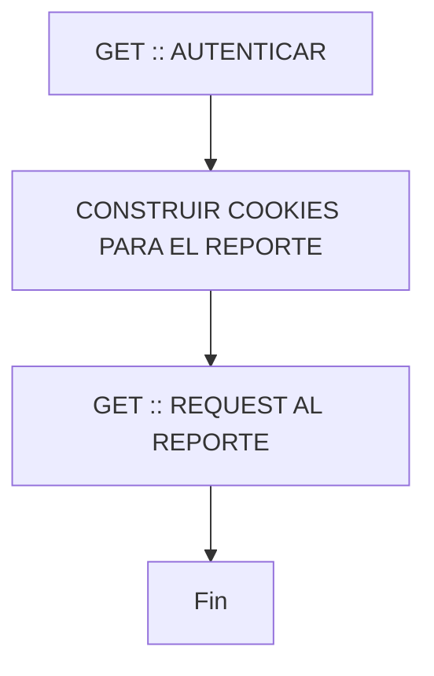

<script src="https://cdn.jsdelivr.net/npm/mermaid@10/dist/mermaid.min.js"></script>
<script>mermaid.initialize({startOnLoad:true});</script>

#
# Demo Embedding Cognos Java 8

#### Jersey, Spring Bot

## Flujo del proceso
<p align="justify">
Diagrama de contexto



<p align="justify">
El alcance es poder embeber reportes de IBM Cognos en una plicación externa	
</p>

- Estrucutra de las cookies
	```
	cookies.put("XSRF-TOKEN", cookiesMap.get("XSRF-TOKEN").getValue());
    cookies.put("cam_passport", cookiesMap.get("cam_passport").getValue());
    cookies.put("usersessionid", cookiesMap.get("usersessionid").getValue());
    cookies.put("CRN", cookiesMap.get("CRN").getValue());
    cookies.put("cea-ssa", cookiesMap.get("cea-ssa").getValue());
    cookies.put("userCapabilities", cookiesMap.get("userCapabilities").getValue());
    cookies.put("userCapabilitiesEx", cookiesMap.get("userCapabilitiesEx").getValue());
	```


## Manual de instalación

- Clonar repositorio
	```
	git clone https://github.com/leoesleoesleo/....
	```
 
- Instalar Java (Ejemplos en Linux Ubuntu)
	```
    java -version
	```
 
    ```
	sudo apt-get install openjdk-8-jdk
	```

- Instalar Maven
	```
	sudo apt-get install maven
	```
 
- Instalar Docker (Opcional)
	```
	sudo apt-get update
	```
 
    ```
	sudo apt-get install docker.io
	```
  
    ```
	sudo systemctl start docker
	```
  
    ```
	sudo systemctl enable docker
	```

### Iniciando proyecto

- Instalar dependencias
	```
	mvn clean install
	```

- correr la app
	```
	mvn spring-boot:run
	```

 - Generar el .jar (Compilar)
	```
	mvn clean package
	```

 - Ubicar el .jar
	```
	java - jar .\target\springtest-0.0.1-SNAPSHOT.jar
	```
 
### Iniciando proyecto con Docker (Opcional)

- Crear imagen
	```
	docker build -t springtest:0.0.1 ./
	```

- Correr aplicación
	```
	docker run -p 8080:8080 springtest:0.0.1
	```

### Recuerda editar urls de los reportes de Cognos en la ruta:
	```
	src/main/java/com/example/springtest/flows/HelloWebRestService.java
	```

### Correr la aplicación
 - Ejecutar aplicación desde NGROK con el fin de generar una url con certificados válidos (https) para que las imagenes puedan cargar con los certificados de seguridad.
 - Ejemplo ruta: https://018b-181-128-238-68.ngrok-free.app/backend/api/helloworld
 - Nota: para que las imagenes carguen correctamente ademas de correr la aplicación en https, tambien será necesario hacer el logueo desde cognos.
   
